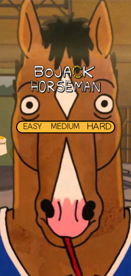
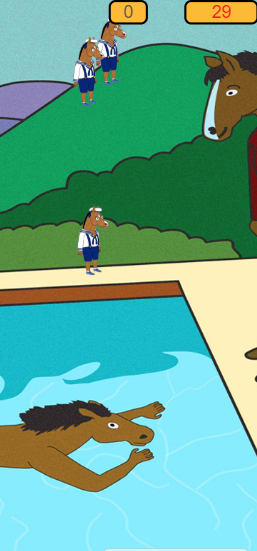
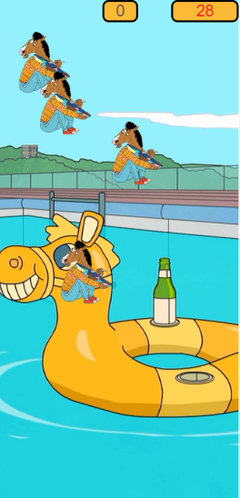
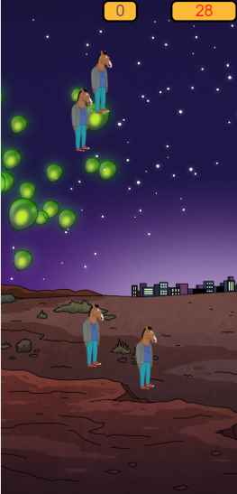

# Bojack Game

[link game](https://bojack-game.000webhostapp.com/index.html)

**Version 1.0.0**

Simple game with theme about bojack. I made this with the purpose to traine my skills in HTML, CSS and test new knowledge in javascript
- This website is responsive
---
# Explanation about the game

In this game is gonna appear some bojacks, if they reach five bojacks you lost. You need to handle whith them for 30 seconds,
and each bojack you click make him disappear. So, you must click in bojacks to not let them reach five for 30 seconds.  
- Easy-level: summom Bojack kid each 0.45 second 
- Medium: summom Bojack young each 0.35 second 
- Hard: summom Bojack adult each 0.25 second  
---
## Images

---
## Contributors

- Raphael S. G. de Andrade <raphaelsatomiandrade@gmail.com>
